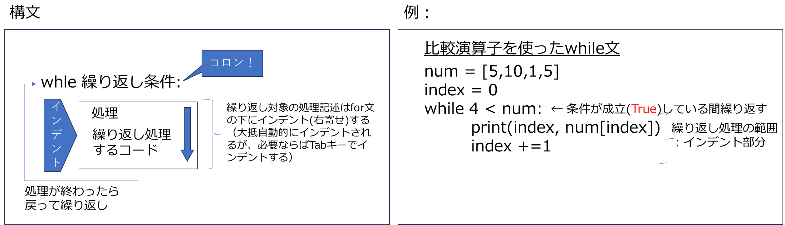

# 3. for文の応用


```python
city = ['高崎市','前橋市','伊勢崎市','水上市']
for i in reversed(city):
    print(i)
```

    水上市
    伊勢崎市
    前橋市
    高崎市
    


```python
cities = [['高崎市','前橋市','伊勢崎市','水上市'],['さいたま市','川越市','熊谷市'],['立川市','武蔵野市','日野市','八王子市','三鷹市']]
for city in cities:
    print(city)
```

    ['高崎市', '前橋市', '伊勢崎市', '水上市']
    ['さいたま市', '川越市', '熊谷市']
    ['立川市', '武蔵野市', '日野市', '八王子市', '三鷹市']
    


```python
for city in cities:
    for c in city:
        print(c)
```

    高崎市
    前橋市
    伊勢崎市
    水上市
    さいたま市
    川越市
    熊谷市
    立川市
    武蔵野市
    日野市
    八王子市
    三鷹市
    

# 演習3.
1. 以下の表をnumpy 2次元配列にせよ  
2. 2重のfor文を使って行毎の合計、および総合計を表示せよ
3. 1重のfor文とnp.sumを使って2.と同じ結果を表示せよ


```
[ [1 2 3]
  [4 5 6]
  [7 8 9]
  [10 11 12] ]

 
```


```python
import numpy as np

```

    [[ 1  2  3]
     [ 4  5  6]
     [ 7  8  9]
     [10 11 12]]
    6
    15
    24
    33
    78
    6
    15
    24
    33
    78
    

# 4.内包表記
for文を使って配列を作る方法。リスト型を作る場合をリスト内包表記、辞書型を作る場合を辞書内包表記と呼ぶ。


```python
# リスト内包表記
alphabet='abcdefg'

alpha_list =[]
for alpha in alphabet:
    alpha_list.append(alpha)
print(alpha_list)
alpha_list = [alpha for alpha in alphabet] 
print(alpha_list)
```

    ['a', 'b', 'c', 'd', 'e', 'f', 'g']
    ['a', 'b', 'c', 'd', 'e', 'f', 'g']
    


```python
# 辞書内包表記
alpha_dic ={}
for i,alpha in enumerate(alphabet):
    alpha_dic[alpha]=i
print(alpha_dic)
alpha_dic = {alpha:i for i,alpha in enumerate(alphabet)}
print(alpha_dic)
```

    {'a': 0, 'b': 1, 'c': 2, 'd': 3, 'e': 4, 'f': 5, 'g': 6}
    {'a': 0, 'b': 1, 'c': 2, 'd': 3, 'e': 4, 'f': 5, 'g': 6}
    

# 演習4.
1. 以下の辞書型の要素を逐次読み、value(人口）だけを要素とするリスト型を作成せよ（リスト内包表記を使う）  
```
saitama_dic1 = {'埼玉県川越市':350745,'埼玉県熊谷市':198742,'埼玉県川口市':578112,'埼玉県行田市':82113,'埼玉県秩父市':63555}
```
2. 以下の2つの辞書型の要素を同時に逐次読み、埼玉県●●市 : 1世帯あたり人数　を要素とする辞書型を作れ（辞書内包表記を使う）
```
人口 saitama_dic1 = {'埼玉県川越市':350745,'埼玉県熊谷市':198742,'埼玉県川口市':578112,'埼玉県行田市':82113,'埼玉県秩父市':63555}
世帯数 saitama_dic2 = {'埼玉県川越市':145715,'埼玉県熊谷市':77004,'埼玉県川口市':245830,'埼玉県行田市':31015,'埼玉県秩父市':24038}
```


```python
saitama_dic1 = {'埼玉県川越市':350745,'埼玉県熊谷市':198742,'埼玉県川口市':578112,'埼玉県行田市':82113,'埼玉県秩父市':63555}
saitama_dic2 = {'埼玉県川越市':145715,'埼玉県熊谷市':77004,'埼玉県川口市':245830,'埼玉県行田市':31015,'埼玉県秩父市':24038}

```

    [350745, 198742, 578112, 82113, 63555]
    {'埼玉県川越市': 2.4070617300895583, '埼玉県熊谷市': 2.580930860734507, '埼玉県川口市': 2.3516739210023188, '埼玉県行田市': 2.647525390939868, '埼玉県秩父市': 2.6439387636242615}
    

# 5. while文による繰り返し処理 





```python
num = [5,10,1,5]
index = 0
while 4 <  num[index]:
    print(index, num[index])
    index +=1
```

    0 5
    1 10
    

### 1) 比較演算子とは


```python
a=5
b=7
c=5
print(a==c)
print(a==b)
print(a!=b)
print(a<b)
print(a>b)
print(a==c**2)
```

    True
    False
    True
    True
    False
    False
    

### 2) 比較演算の評価結果がTrueならwhile文を実行する
繰り返し毎に変数numに入る値を想像すること


```python
num = 0
while 5 > num:
    print(num)
    num +=1
```

    0
    1
    2
    3
    4
    

### 3) 無限ループ
終わらないので、■を押して強制終了してください


```python
import time
num = 0
while True:
    print(num)
    num +=1
    time.sleep(1)
```

    0
    1
    2
    3
    4
    


    ---------------------------------------------------------------------------

    KeyboardInterrupt                         Traceback (most recent call last)

    Cell In[7], line 6
          4 print(num)
          5 num +=1
    ----> 6 time.sleep(1)
    

    KeyboardInterrupt: 


5. moji='今日は晴れ'からfor文を使って1文字づつ取り出し、これらの文字をつなげて'今日は晴れ'を再度表示せよ


```python
moji='今日は晴れ'
sentence=''
for m in moji:
    sentence+=m
print(sentence)
```

    今日は晴れ
    

# 演習5.
1. 以下のfor文と同じ処理をwhile文で書け


```python
a = [1,2,3,4,5]
total =0
for i in a:
    total+=i
print(total)
    
```

    15
    


```python
a = [1,2,3,4,5]
total =0
idx = 0
while idx <5:
    total+=a[idx]
    idx +=1
print(total)
```

    15
    

2. 以下のコーディングで、gunmaの要素のうち、'前橋市','伊勢崎市','水上市'のみ逐次取り出して表示するプログラムを完成させよ(for文、while文の2通りでかけ


```python
gunma=['高崎市','前橋市','伊勢崎市','水上市']
for c in range(3):
    print(gunma[c+1])

index=1
while index < len(gunma):
    print(gunma[index])
    index+=1
```


